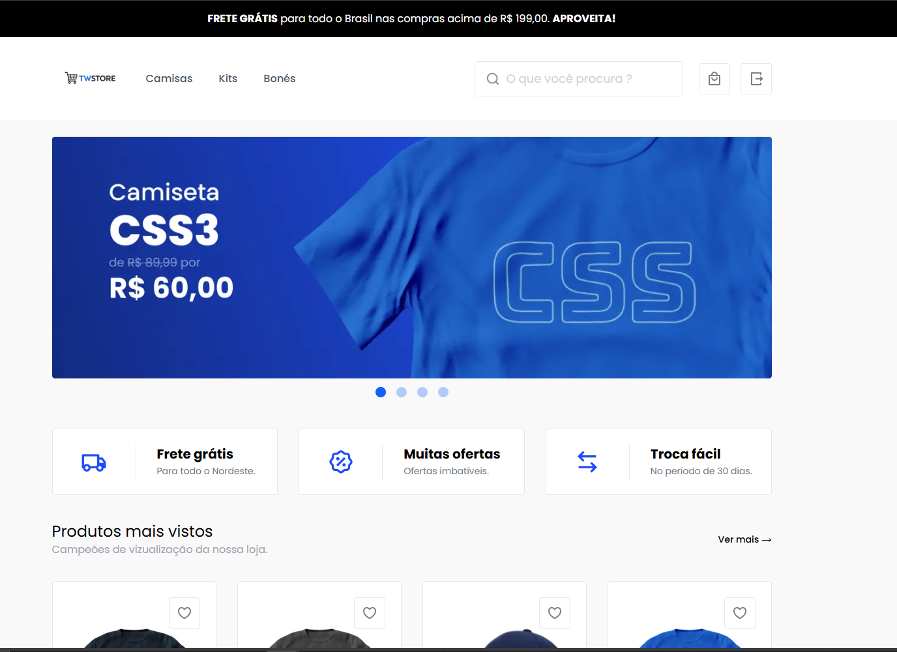
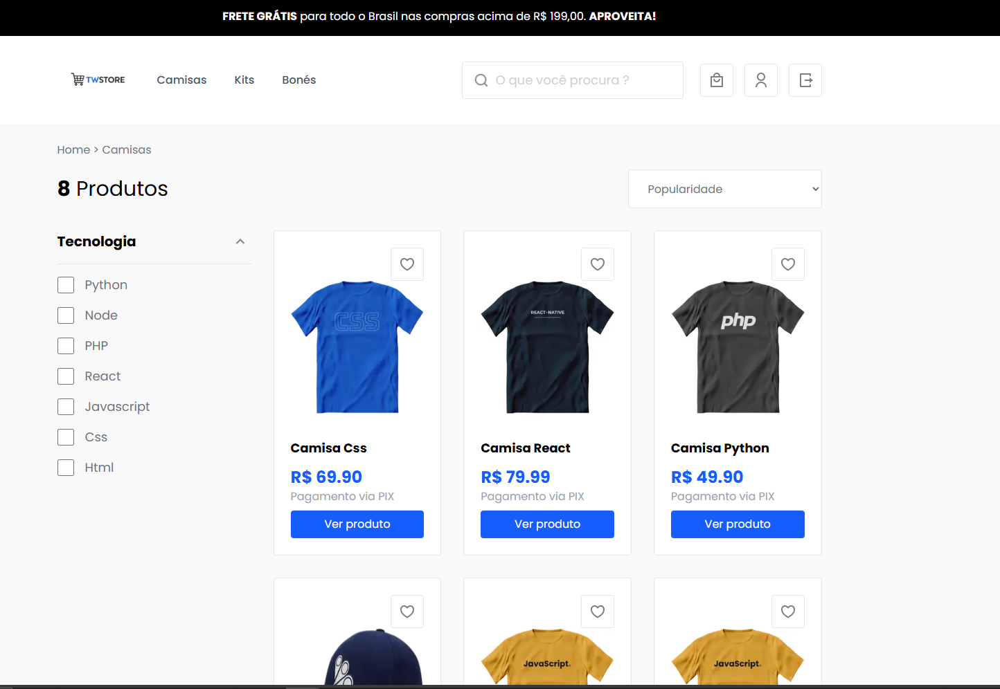
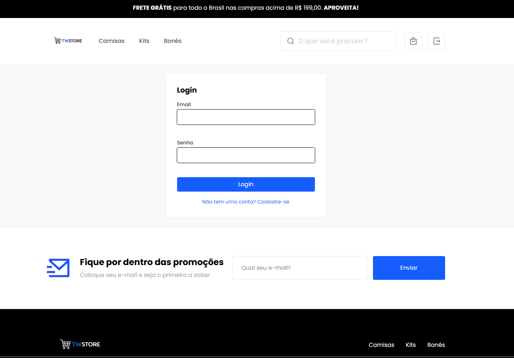
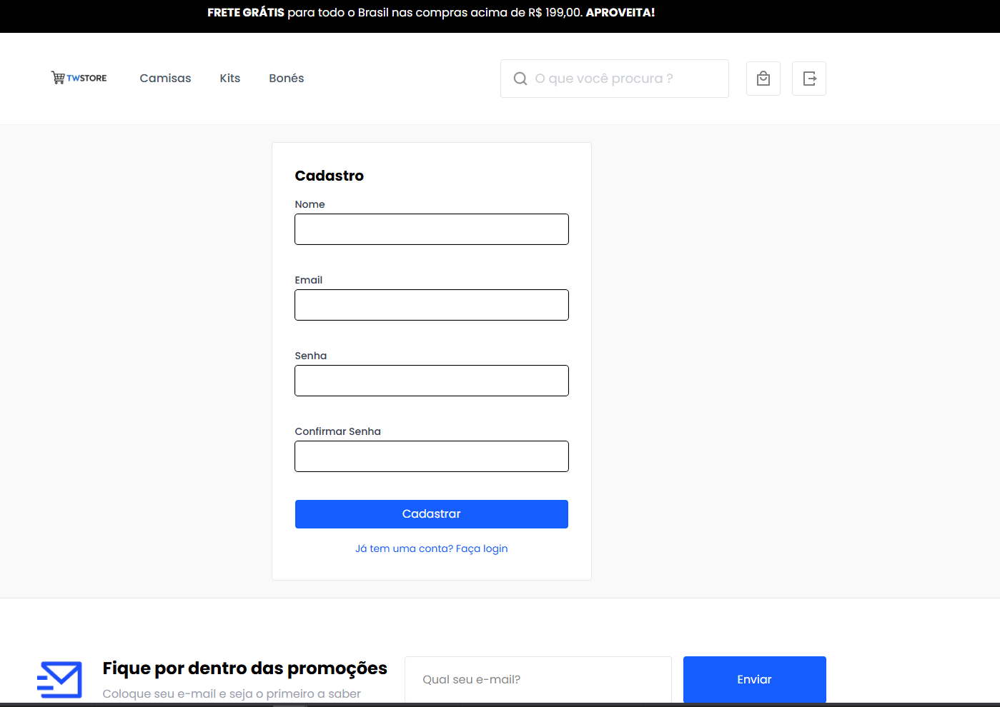
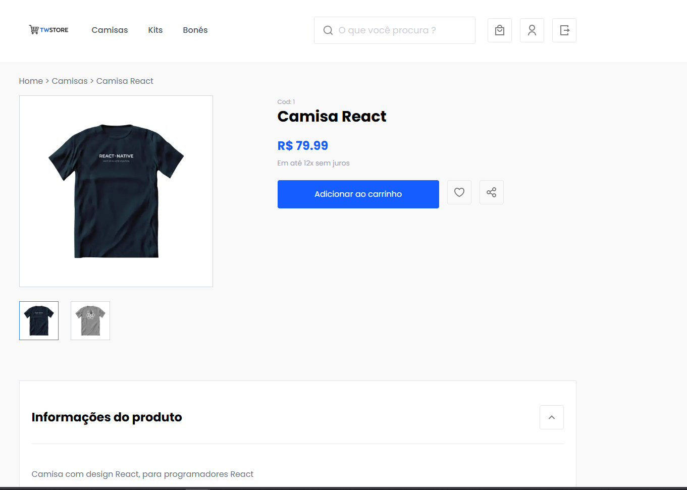
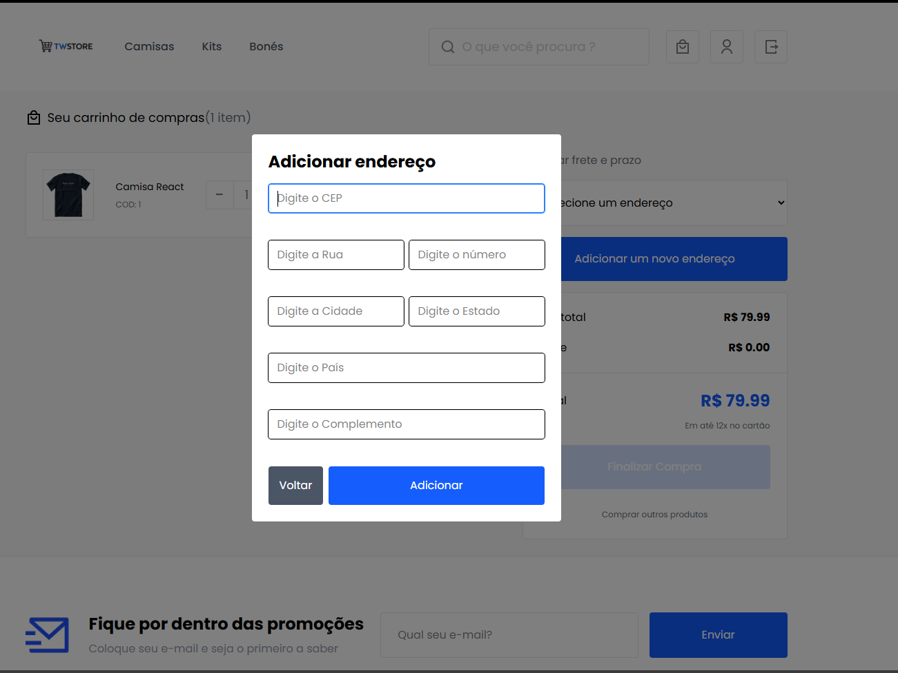
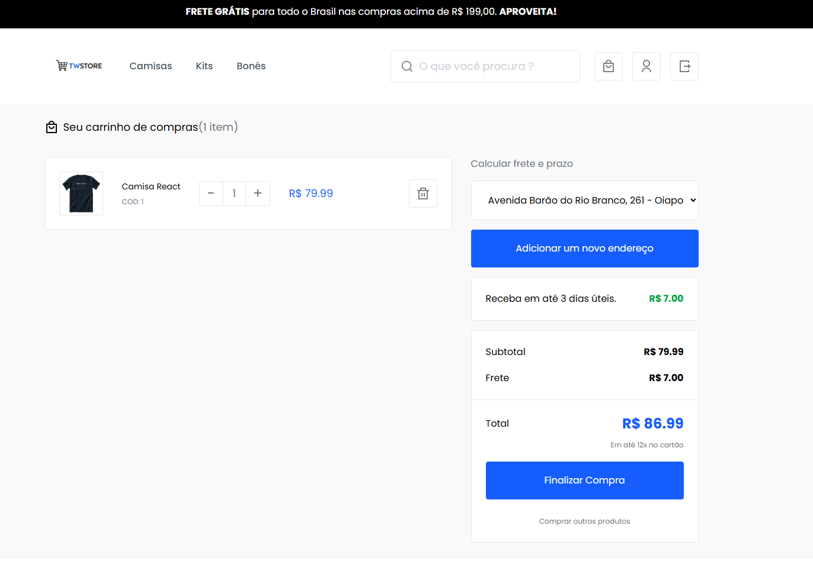
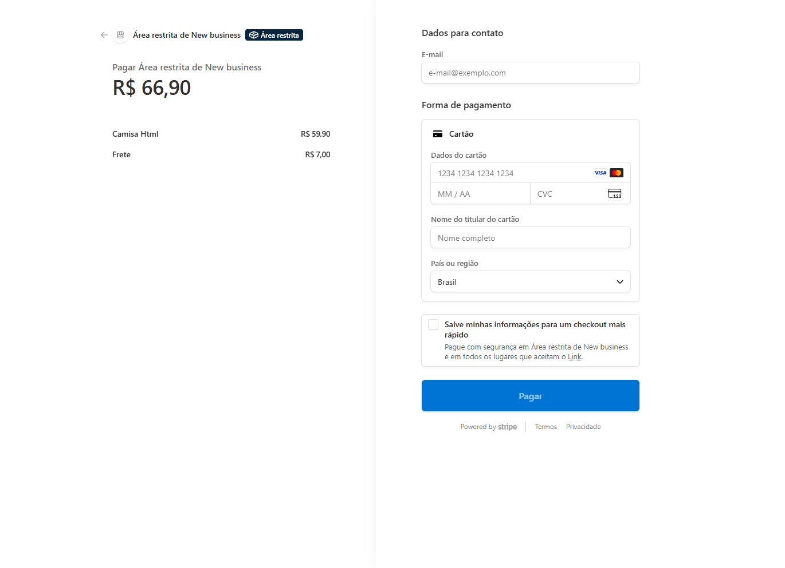

# TWSTORE Frontend

Frontend de um e-commerce construído com Next.js, focado na navegação de catálogo, autenticação de usuários, favoritos, carrinho e acompanhamento de pedidos.

O projeto consome uma API externa para produtos, banners, autenticação, endereços, frete e finalização da compra, combinando renderização no servidor com estado client-side para melhorar a experiência da loja.

Repositório da API:

- https://github.com/weitzz/ecommerce-api




















## Visão geral

Principais fluxos já implementados:

- Home com banners e vitrines de produtos mais vistos e mais vendidos
- Listagem por categoria com filtros dinâmicos
- Busca de produtos
- Página de detalhes de produto e relacionados
- Cadastro e login com persistência de sessão por cookies
- Área autenticada com pedidos, favoritos e perfil
- Carrinho com controle de quantidade, cálculo de frete e seleção de endereço
- Finalização de compra com redirecionamento para o Stripe Checkout a partir da URL retornada pela API

## Stack utilizada

- Next.js 16 com App Router
- React 19
- TypeScript
- Tailwind CSS 4
- Zustand para estado global no cliente
- Zod para validação de formulários
- Vitest + Testing Library para testes

## Estrutura do projeto

```text
src/
  app/            Rotas, layouts, middleware e handlers da aplicação
  actions/        Server Actions para comunicação com a API
  components/     Componentes de interface por domínio
  libs/           Helpers de API, cookies, autenticação e utilitários
  providers/      Providers e hidratação de estado
  schemas/        Schemas de validação com Zod
  store/          Stores globais com Zustand
  types/          Tipagens compartilhadas
public/           Imagens, ícones e banners estáticos
```

## Requisitos

- Node.js 20+ recomendado
- npm 10+ recomendado
- Backend da API disponível
- API deste projeto: https://github.com/weitzz/ecommerce-api

## Como rodar localmente

1. Instale as dependências:

```bash
npm install
```

2. Crie um arquivo `.env.local` com a URL base da API:

```env
NEXT_PUBLIC_API_BASE=https://sua-api.com
```

3. Inicie o servidor de desenvolvimento:

```bash
npm run dev
```

4. Acesse:

```text
http://localhost:3000
```

## Variáveis de ambiente

Variáveis usadas pelo frontend:

- `NEXT_PUBLIC_API_BASE`: URL base da API consumida pelo projeto

Exemplo usando a API do projeto:

```env
NEXT_PUBLIC_API_BASE=http://localhost:3001
```

Observação:

- Como a aplicação faz chamadas no cliente e no servidor, essa variável precisa estar definida para que login, catálogo, pedidos, favoritos, frete e checkout funcionem corretamente.

## Scripts disponíveis

```bash
npm run dev            # inicia o ambiente de desenvolvimento
npm run build          # gera a build de produção
npm run start          # sobe a aplicação em modo produção
npm run test           # executa os testes uma vez
npm run test:watch     # executa os testes em modo watch
npm run test:coverage  # gera relatório de cobertura
```

## Autenticação e rotas protegidas

O projeto utiliza cookies para armazenar sessão e middleware para proteger áreas privadas.

Rotas protegidas atualmente:

- `/me`
- `/dashboard`
- `/cart`

Se o access token estiver expirado, o middleware tenta renovar a sessão com o refresh token antes de redirecionar para o login.

## Checkout e pagamento

O fluxo de fechamento do carrinho envia os itens e o endereço selecionado para a API, que retorna a URL da sessão de pagamento.

Com essa resposta, o frontend redireciona o usuário para o Stripe Checkout para concluir o pagamento.

## Testes

Os testes usam:

- `Vitest` como test runner
- `jsdom` para ambiente de navegador
- `@testing-library/react` para testes de componentes
- `@testing-library/jest-dom` para matchers adicionais

Para rodar todos os testes:

```bash
npm run test
```

## Destaques de arquitetura

- `src/actions/`: centraliza as operações de leitura e escrita com a API
- `src/libs/api-server.ts`: encapsula chamadas autenticadas feitas no servidor
- `src/libs/api-client.ts`: encapsula chamadas feitas no cliente
- `src/store/`: concentra estado de carrinho, autenticação, menu e favoritos
- `src/middleware.ts`: garante acesso apenas a rotas autenticadas

## Melhorias futuras

- Documentar contrato da API consumida
- Adicionar CI para build e testes
- Expandir cobertura de testes para fluxos críticos de checkout
- Melhorar metadata e SEO das páginas
